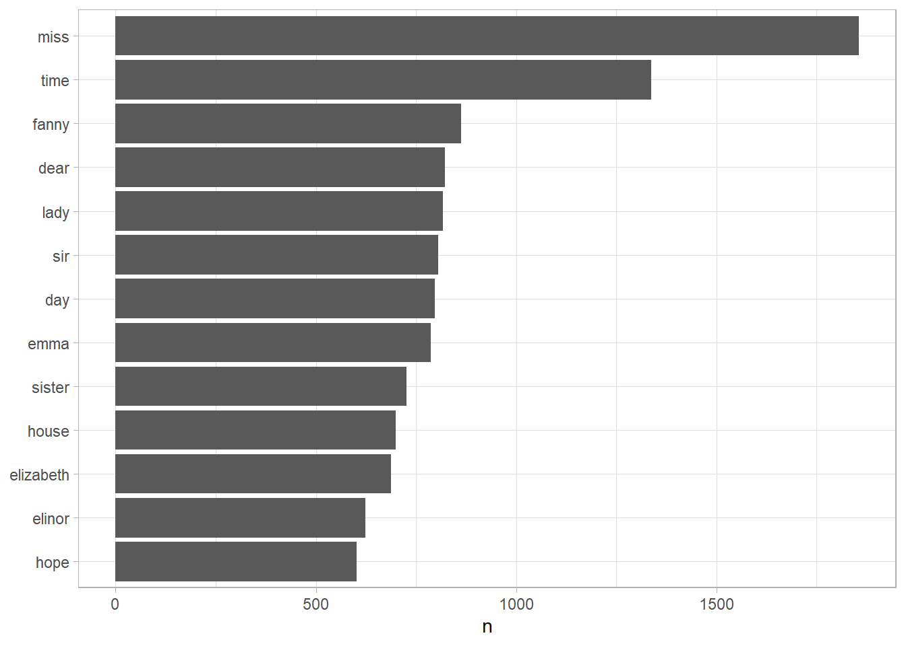

# Text Mining (Eng) {#tm-eng}

## janeaustenr {#janeaustenr}

> 출처 : R로 배우는 텍스트 마이닝

제인 오스틴(Jane Austen)이 탈고해 출판한 소설 여섯 개를 [janeaustenr](https://cran.r-project.org/package=janeaustenr) 패키지 에서 가져온 다음 tidy 형식으로 변형해 보자.

-   janeaustenr 패키지는 텍스트를 1줄당 1행(one-row-per-line) 형식으로 제공
-   `mutate()`를 사용해 `linenumber` 수에 해당하는 만큼을 주석으로 처리함으로써 원래 줄 형식을 추적하는데 사용
-   `chapter`를 사용해 모든 장이 어디부터 나오는지 찾아낸다


```r
library(janeaustenr)
library(dplyr)
library(stringr)

original_books <- austen_books() %>%
  group_by(book) %>%
  mutate(linenumber = row_number(),
         chapter = cumsum(str_detect(text, 
                                     regex("^chapter [\\divxlc]",
                                           ignore_case = TRUE)))) %>%
  ungroup()

original_books
#> # A tibble: 73,422 x 4
#>    text                    book                linenumber chapter
#>    <chr>                   <fct>                    <int>   <int>
#>  1 "SENSE AND SENSIBILITY" Sense & Sensibility          1       0
#>  2 ""                      Sense & Sensibility          2       0
#>  3 "by Jane Austen"        Sense & Sensibility          3       0
#>  4 ""                      Sense & Sensibility          4       0
#>  5 "(1811)"                Sense & Sensibility          5       0
#>  6 ""                      Sense & Sensibility          6       0
#>  7 ""                      Sense & Sensibility          7       0
#>  8 ""                      Sense & Sensibility          8       0
#>  9 ""                      Sense & Sensibility          9       0
#> 10 "CHAPTER 1"             Sense & Sensibility         10       1
#> # ... with 73,412 more rows
```

이것을 tidy 데이터셋으로 사용하려면 `unnest_tokens()` 함수를 사용해 **1행당 1토큰(one-token-per-row)** 형식으로 구성해야 한다.


```r
library(tidytext)
tidy_books <- original_books %>%
  unnest_tokens(word, text)

tidy_books
#> # A tibble: 725,055 x 4
#>    book                linenumber chapter word       
#>    <fct>                    <int>   <int> <chr>      
#>  1 Sense & Sensibility          1       0 sense      
#>  2 Sense & Sensibility          1       0 and        
#>  3 Sense & Sensibility          1       0 sensibility
#>  4 Sense & Sensibility          3       0 by         
#>  5 Sense & Sensibility          3       0 jane       
#>  6 Sense & Sensibility          3       0 austen     
#>  7 Sense & Sensibility          5       0 1811       
#>  8 Sense & Sensibility         10       1 chapter    
#>  9 Sense & Sensibility         10       1 1          
#> 10 Sense & Sensibility         13       1 the        
#> # ... with 725,045 more rows
```

이 함수는 [tokenizers](https://github.com/ropensci/tokenizers)를 사용해 원래 데이터 프레임에 있는 텍스트의 각 행을 토큰으로 분리한다. 기본 토큰화는 단어에 대한 것이지만 다른 옵션을 사용하면 문자, 엔그램, 문장, 줄, 단락 단위로 토큰호하 할 수 있고, 또는 정규 표혀노식 패턴을 사용해서 분리할 수 있다.

불용어(stop words)는 분석에 유용하지 않은 단어들을 말하며, 일반적으로 영어의 'the', 'of', 'to' 등과 같은 매우 전형적인 단어를 말한다. `anti_join()`을 사용해 불용어를 제거할 수 있다. 이 때, 사용되는 불용어는 `stop_words`를 사용한다.


```r
data(stop_words)

tidy_books <- tidy_books %>%
  anti_join(stop_words)

tidy_books
#> # A tibble: 217,609 x 4
#>    book                linenumber chapter word       
#>    <fct>                    <int>   <int> <chr>      
#>  1 Sense & Sensibility          1       0 sense      
#>  2 Sense & Sensibility          1       0 sensibility
#>  3 Sense & Sensibility          3       0 jane       
#>  4 Sense & Sensibility          3       0 austen     
#>  5 Sense & Sensibility          5       0 1811       
#>  6 Sense & Sensibility         10       1 chapter    
#>  7 Sense & Sensibility         10       1 1          
#>  8 Sense & Sensibility         13       1 family     
#>  9 Sense & Sensibility         13       1 dashwood   
#> 10 Sense & Sensibility         13       1 settled    
#> # ... with 217,599 more rows
```

tidytext 패키지의 `stop_words` 데이터셋에는 3개의 불용어 용어집(lexicon)이 들어있다. 지금처럼 모두 함께 사용할 수도 있고, 특정 분석에 더 적합한 경우 `filter()`를 사용해 1개 불용어 집합만 사용할 수도 있다.

또한, dplyr의 `count()`를 사용해 모든 도서에서 가장 흔하게 나오는 단어를 찾을 수 있다.


```r
tidy_books %>%
  count(word, sort = TRUE) 
#> # A tibble: 13,914 x 2
#>    word       n
#>    <chr>  <int>
#>  1 miss    1855
#>  2 time    1337
#>  3 fanny    862
#>  4 dear     822
#>  5 lady     817
#>  6 sir      806
#>  7 day      797
#>  8 emma     787
#>  9 sister   727
#> 10 house    699
#> # ... with 13,904 more rows
```

단어 카운트(word count) 결과는 tidy data frame에 저장되었기 때문에 아래처럼 ggplot2 패키지로 직접 연결(pipe)할 수 있습니다 (Figure \@ref(fig:plotcount)).


```r
library(ggplot2)

tidy_books %>%
  count(word, sort = TRUE) %>%
  filter(n > 600) %>%
  mutate(word = reorder(word, n)) %>%
  ggplot(aes(n, word)) +
  geom_col() +
  labs(y = NULL)
```

<div class="figure" style="text-align: center">

<p class="caption">(\#fig:plotcount)The most common words in Jane Austen's novels</p>
</div>

## gutenbergr {#gutenbergr}

[gutenbergr](https://github.com/ropensci/gutenbergr) 패키지는 구텐베르크 프로젝트 모음집 중 공공 저작물에 해당하는 텍스트에 접근할 수 있게 한다. 이 패키지에는 도서를 내려받기 위한 도구와 관심있는 작품을 찾는데 사용할 수 있는 구텐베르크 프로젝트 메타데이터의 전체 데이터셋이 포함되어 있다. 

> gutenbergr에 대한 자세한 내용은 rOpenSci의 패키지 튜토리얼(https://ropensci.org/tutorials/gutenbergr_tutorial/)을 참조하자. 

### 단어 빈도

먼저 19세기 말부터 20세기 초반에 걸쳐 살았던 웰스의 공상 과학 소설과 판타지 소설을 살펴보자.

- [*The Time Machine*](https://www.gutenberg.org/ebooks/35)
- [*The War of the Worlds*](https://www.gutenberg.org/ebooks/36)
- [*The Invisible Man*](https://www.gutenberg.org/ebooks/5230)
- [*The Island of Doctor Moreau*](https://www.gutenberg.org/ebooks/159)

우리는 `gutenberg_download()`와 각 소설에 대한 구텐베르크 프로젝트 식별 번호를 사용해 이러한 작품에 액세스할 수 있다.


```r
library(gutenbergr)

hgwells <- gutenberg_download(c(35, 36, 5230, 159))

tidy_hgwells <- hgwells %>%
  unnest_tokens(word, text) %>%
  anti_join(stop_words)
```

재미 삼아서 웰스의 소설에 가장 공통적으로 나오는 단어는 무엇인지 알아보자.


```r
tidy_hgwells %>%
  count(word, sort = TRUE)
#> # A tibble: 11,811 x 2
#>    word       n
#>    <chr>  <int>
#>  1 time     461
#>  2 people   302
#>  3 door     260
#>  4 heard    249
#>  5 black    232
#>  6 stood    229
#>  7 white    224
#>  8 hand     218
#>  9 kemp     213
#> 10 eyes     210
#> # ... with 11,801 more rows
```

이번에는 브론테(Bronte) 자매의 유명한 작품을 입수해 볼 텐데, 브론테 잗매는 제인 오스틴과 비슷한 시대를 살았지만 오히려 다른 문체로 글을 썼다.

- [*Jane Eyre*](https://www.gutenberg.org/ebooks/1260)
- [*Wuthering Heights*](https://www.gutenberg.org/ebooks/768)
- [*The Tenant of Wildfell Hall*](https://www.gutenberg.org/ebooks/969)
- [*Villette*](https://www.gutenberg.org/ebooks/9182)
- [*Agnes Grey*](https://www.gutenberg.org/ebooks/767)

각 소설에 구텐베르크 프로젝트 식별 번호를 다시 사용하고 `gutenberg_download()`를 사용하면 해당 텍스트에 액세스할 수 있다.


```r
bronte <- gutenberg_download(c(1260, 768, 969, 9182, 767))

tidy_bronte <- bronte %>%
  unnest_tokens(word, text) %>%
  anti_join(stop_words)
```

브론테 자매의 소설에서 가장 자주 출현하는 단어는 무엇인가?


```r
tidy_bronte %>%
  count(word, sort = TRUE)
#> # A tibble: 23,297 x 2
#>    word       n
#>    <chr>  <int>
#>  1 time    1065
#>  2 miss     854
#>  3 day      825
#>  4 hand     767
#>  5 eyes     714
#>  6 don’t    666
#>  7 night    648
#>  8 heart    638
#>  9 looked   601
#> 10 door     591
#> # ... with 23,287 more rows
```

우레스와 브론테 자매의 작품들에서 모두 "time", "eyes", and "hand" 라는 단어가 상위 10위 안에 속 "time", "ey "time", "ey Brontë sisters.

이제 제인 오스틴, 브론테 자매 및 웰스의 작품에서 각 단어의 빈도를 계산해 보고 데이터 프레임을 함께 묶자. 우리는 tidyr의 `spread()`와 `gather()`를 사용해 데이터 프레임을 재구성함으로써 세 개의 소설을 그려서 비교하기에 알맞게 한다.


```r
library(tidyr)

frequency <- bind_rows(mutate(tidy_bronte, author = "Brontë Sisters"),
                       mutate(tidy_hgwells, author = "H.G. Wells"),
                       mutate(tidy_books, author = "Jane Austen")) %>%
             mutate(word = str_extract(word, "[a-z']+")) %>%
             count(author, word) %>%
             group_by(author) %>%
             mutate(proportion = n / sum(n)) %>%
             select(-n) %>%
             pivot_wider(names_from = author, values_from = proportion) %>%
             pivot_longer(`Brontë Sisters`:`H.G. Wells`,
                          names_to = "author",
                          values_to = "proportion")
frequency
#> # A tibble: 57,116 x 4
#>    word      `Jane Austen` author          proportion
#>    <chr>             <dbl> <chr>                <dbl>
#>  1 a            0.00000919 Bronte Sisters  0.0000587 
#>  2 a            0.00000919 H.G. Wells      0.0000147 
#>  3 aback       NA          Bronte Sisters  0.00000391
#>  4 aback       NA          H.G. Wells      0.0000147 
#>  5 abaht       NA          Bronte Sisters  0.00000391
#>  6 abaht       NA          H.G. Wells     NA         
#>  7 abandon     NA          Bronte Sisters  0.0000313 
#>  8 abandon     NA          H.G. Wells      0.0000147 
#>  9 abandoned    0.00000460 Bronte Sisters  0.0000900 
#> 10 abandoned    0.00000460 H.G. Wells      0.000177  
#> # ... with 57,106 more rows
```

구텐베르그 프로젝트 내 UTF-8로 인코딩된 텍스트에 밑줄을 쳐서 강조한(기울임 꼴처럼) 몇 가지 사례가 들어 있으므로 여기서는 `str_extract()`를 사용할 것이다. tokenizer는 이렇게 강조 처리한 단어를 강조 처리를 하지 않은 단어와 서로 다른 단어로 여기지만, `str_extract()`를 사용해 보기 전에 우리가 초기 데이터 탐색 작업을 할 때에 보았듯이 우리는 '**any**'와 'any'를 따로 세기를 원하지 않는다.

이제 그래프를 그려보자(Figure \@ref(fig:plotcompare)).


```r
library(scales)

# 결측값(missing values)이 제거된 행(row)에 대한 경고가 표시될 수 있다.
ggplot(frequency, aes(x = proportion, y = `Jane Austen`, 
                      color = abs(`Jane Austen` - proportion))) +
  geom_abline(color = "gray40", lty = 2) +
  geom_jitter(alpha = 0.1, size = 2.5, width = 0.3, height = 0.3) +
  geom_text(aes(label = word), check_overlap = TRUE, vjust = 1.5) +
  scale_x_log10(labels = percent_format()) +
  scale_y_log10(labels = percent_format()) +
  scale_color_gradient(limits = c(0, 0.001), 
                       low = "darkslategray4", high = "gray75") +
  facet_wrap(~author, ncol = 2) +
  theme(legend.position="none") +
  labs(y = "Jane Austen", x = NULL)
```

<div class="figure" style="text-align: center">

<p class="caption">(\#fig:plotcompare)Comparing the word frequencies of Jane Austen, the Bronte sisters, and H.G. Wells</p>
</div>

이 그림들 중에서 점선에 가까운 단어는 두 텍스트 집합에서 모두 비슷한 빈도를 보이는데, 예를 들면 오스틴과 브론테의 텍스트를 비교한 경우(빈도가 높은 상단에 'miss', 'tiem', 'day'가 있음)와 오스틴과 웰스의 텍스트를 비교한 경우(빈도가 높은 상단에 'time', 'day', 'brother'가 있음)를 들 수 있다. 점선에서 멀리 떨어져 있는 단어는 어느 한쪽 텍스트 집합에서만 더 많이 발견되는 단어다. 예를 들어 오스틴-브론테 비교 그림에서 'elizabeth', 'anne', 'fanny'와 같은 단어(모두 고유 명사)는 오스틴의 텍스트에는 많지만 브론테 텍스트에는 많지 않고, 'arthur'와 'dog'는 브론테 텍스트에는 있지만 오스틴 텍스트에는 없다. 웰스를 제인 오스틴과 비교해 보면 웰스가 쓰는 'beast', 'guns', 'feet', 'black'과 같은 단어를 오스틴은 쓰지 않는 반면에, 오스틴이 사용하는 'family', 'friend', 'letter', 'dear'와 같은 단어를 웰스는 쓰지 않는다.

전반적으로 그림에서 오스틴-브론테 비교 그래프에 나오는 단어들이 오스틴-웰스 비교 그래프에 나오는 것보다 기울게 그어진 점선에 더 가까이 있다는 점에 주목하자. 또한 단어가 오스틴-브론테 그래프에서 빈도가 더 낮은 곳까지 퍼져 있다는 점에 주목하자. 오스텐-웰스 비교 그래프에서 빈도가 낮은 곳이 비어있다. 이러한 특성은 오스틴이 웰스보다는 브론테와 더 비슷한 단어를 사용함을 나타낸다. 또한 우리는 모든 단어가 세 가지 집합으로 이뤄진 텍스트 모두에 나오지는 않는다는 점과, 오스틴과 웰스의 빈도를 나타낸 그래프에 데이터 점이 적다는 것을 알 수 있다.

이러한 단어 집합의 유사성과 차이점을 상관 검정을 통해 정량화(quantify, 수량화)해 보자. 오스틴과 브론테 자매 사이, 오스틴과 웰스 사이의 단어 빈도는 어떤 상관(correlation)이 있는가?


```r
cor.test(data = frequency[frequency$author == "Brontë Sisters",],
         ~ proportion + `Jane Austen`)
#> 
#> 	Pearson's product-moment correlation
#> 
#> data:  proportion and Jane Austen
#> t = 111.06, df = 10346, p-value < 2.2e-16
#> alternative hypothesis: true correlation is not equal to 0
#> 95 percent confidence interval:
#>  0.7285370 0.7461189
#> sample estimates:
#>       cor 
#> 0.7374529
cor.test(data = frequency[frequency$author == "H.G. Wells",], 
         ~ proportion + `Jane Austen`)
#> 
#> 	Pearson's product-moment correlation
#> 
#> data:  proportion and Jane Austen
#> t = 35.229, df = 6008, p-value < 2.2e-16
#> alternative hypothesis: true correlation is not equal to 0
#> 95 percent confidence interval:
#>  0.3925914 0.4345047
#> sample estimates:
#>       cor 
#> 0.4137673
```

우리가 그래프에서 볼 수 있었듯이 오스틴과 웰스 사이보다는 오스틴과 브론테 소설 사이에서 단어의 빈도가 더 많이 연관되어 있다.
