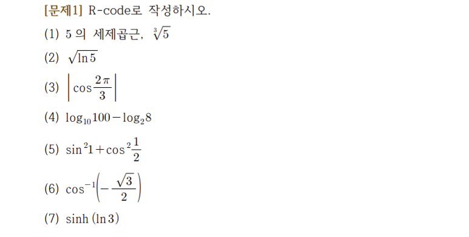

# (PART) Programming {-}

#  Mathematical Operation {#math}

## Quiz

- 네이버 지식인 문제 풀이 ([링크](https://kin.naver.com/qna/detail.naver?d1id=1&dirId=104&docId=415951163&qb=Ug==&enc=utf8&section=kin.qna.all&rank=1&search_sort=3&spq=0&mode=answer))



```{r}
#1
5^(1/3)
```

```{r}
#2
log(5)^(1/2)
```

```{r}
#3
cos(2/3*pi)
```

```{r}
#4
log10(100) - log2(8)
```

```{r}
#5
sin(1)^2 + cos(1/2)^2
```

```{r}
#6
1/cos(-(3^(1/2)/2))
```

```{r}
#7
sinh(log(3))
```